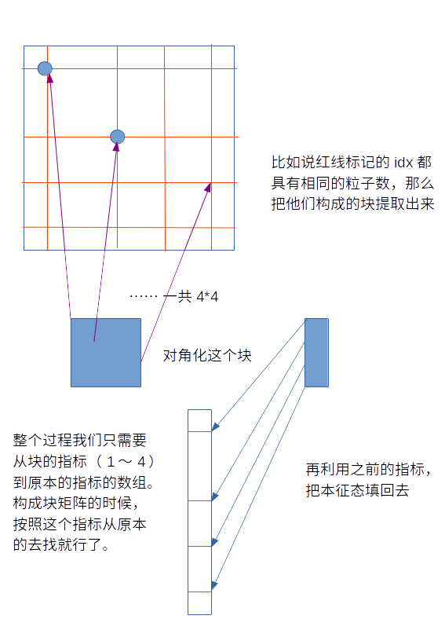
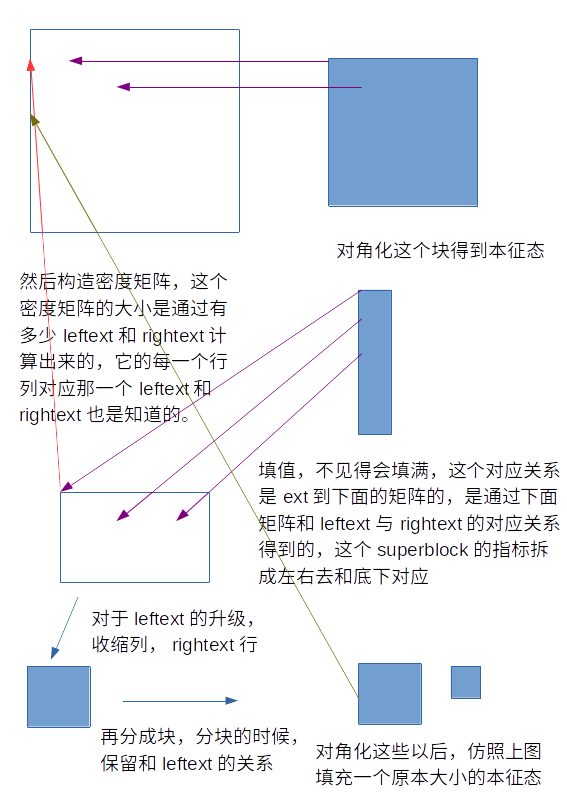

获得基的变换的过程
======

## NRG中的get_phival
在对角化哈密顿量的时候，可以确定的是不同的自旋粒子数之间一定是零。  
这个时候找到所有符合要求的idx，让他们组成一个块矩阵，然后对角化，  
得到这个块上面的本征态。如图。  
  
所以对所有可能的粒子数的sector进行循环，对角化每一个块，然后在把  
本征值，本征态的对存储起来，这时候的本征态是填充了0的，把基填充回  
原本的大小。如果在nrg算法过程中没有指定固定的自旋sector，随后会  
从所有的块中按照能量由低到高的顺序得到新的基的变换（由本征态作为  
一列）  

## DMRG中的get_phival
DMRG过程中的get_phival要复杂的多，因为还涉及到密度矩阵的计算。首  
先，从superblock的哈密顿量中找到想要的block，对角化它以找到基态，  
这时候这个基态是在一个sector上面的，会有一个基态向量的指标到现在的  
superblock上的指标的数组。如图。  
  
再构造密度矩阵的时候，先找出合适的矩阵大小和这个矩阵的行到leftext  
列到rightext的关系（这个矩阵往往是比那个基态维度高一些的，因为  某  
些leftext和rightext的组合不在想要的sector）,然后从基态中把值填到  
这个矩阵当中去。填的方法是，基态向量的指标转换到superblock的指标，  
superblock的指标拆开成leftext，rightext，查找leftext在哪一行  
rightext在哪一列，赋值。这里得到的是求Tr之前的密度矩阵，想要的到用  
来升级基的密度矩阵，需要收缩它的一个指标（矩阵乘法即可）  
然后，可以知道的是，密度矩阵也一定是分块的  因为，不同粒子数厄的  
leftext或者rightext，他们的另一半的粒子数也一定不同，是肯定不会在  
另一半的Tr中存活下来的。有了这个矩阵的行和列到ext上的编号，分成小块  
的密度矩阵到ext上的编号也就容易知道了。这里通过找到粒子数相同的各个  
小块和他们到ext的关系，然后构成矩阵。赋值的时候通过密度矩阵到ext的关  
系和小块到ext的关系相对应来赋值。  
总结一下就是，在找块矩阵的时候，首先构造好块到原本的基的对应关系，再从  
这个对应关系反推这个值应该在块的什么位置上。
